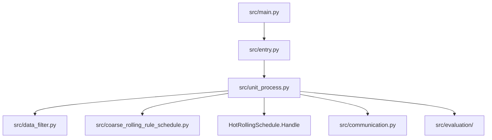

# 主流程调用链（main -> entry -> unit_process）

本文描述运行时真实调用链，覆盖四类入口：
- 标准排程
- 人工计划（manual）
- 统计模式（statistics）
- 辊期重算（ROLL replay）

## 1. 总体结构

## 2. main 层：报文分支与路由

入口文件：`src/main.py`，核心函数：`unit_choice(sock, addr)`。

- 分支A：`ROLL...` 报文  
  - 解析 `roll_id|unit|config_type`
  - 调用 `entry.entry_roll_replay(roll_id, unit_name, config_type)`
- 分支B：标准产线报文  
  - 校验 `message[:4]` 是否在允许产线标识中
  - 解析后调用 `entry.entry(...)`
  - 进一步在 `entry` 层分发到 normal/manual/statistics

## 3. entry 层：统一入口与响应安全化

入口文件：`src/entry.py`。

- `entry(unit, id)`：
  - `len(id)==3 and id!='all'` -> `entrance_manual()`
  - `len(id)==3 and id=='all'` -> `entrance_statistics()`
  - 其他 -> `entrance()`
- `entry_roll_replay(...)`：
  - 构造 `message_id`
  - 调用 `UnitProcessor(...).entrance_roll_replay()`
- 返回前统一做 `_sanitize_response`（仅处理 `message_content`）

## 4. 标准排程主链（entrance）

核心函数：`UnitProcessor.entrance()`。

1. `get_unit_info()`：加载产线配置  
2. `Communication()`：建立 DB 通道  
3. `get_total_data(c)`：按 `unit_dict` 读取输入表  
4. `data_preprocess(...)`：去重、空值、类型等预处理  
5. `data_processor()`：标注 + 筛选 + 构建 `config_dict`  
6. `schedule_new()`：先粗排，再主算法  
7. `build_and_write_all_schedule_results()`：统一写库（粗排 n / 主算法 n+1）  
8. `save_all_data_with_error_handling(...)`：保存过程数据  
9. `evaluation()` + `score_and_save_results()`（`setting.EVALUATION=True` 时）

## 5. 算法子链（schedule_new）

- 粗排：`_run_coarse_rule_schedule_with_timeout(jdata)`  
  - 输出 `coarse_rule_schedule_result.csv`
  - 不可执行时可返回 `status=not_executable`（仍保持文件契约）
- 主算法：`schedule(...)`  
  - `setting.ALGORITHM=True` 时调用 `HotRollingSchedule.Handle`
  - `False` 时走简化测试路径

## 6. 人工计划链（entrance_manual）

- 仍会经历：配置加载 -> DB连接 -> 取数 -> 预处理  
- 再从 `id` 第三段解析手工板坯号列表，调用 `concat(...)`  
- `build_result_data()` + `build_sql()` + `write_data()` 落库  

## 7. 统计模式链（entrance_statistics）

- 逻辑重点：标注统计，不做标准排程写库链路
- 输出 `message_content` 为统计结果文本（JSON 字符串）

## 8. 辊期重算链（entrance_roll_replay）

- 解析辊期号与可选产线/配置类型
- 从备份目录加载历史核心数据（库存/标记/配置）
- 从 DB 读取最新规则并合并
- 执行排程并写库，返回统一响应信封

## 9. 关键状态与消息

- 统一响应结构：`message_type` + `message_content`
- 典型失败点：
  - 配置加载失败
  - DB连接失败
  - 输入表空/字段异常
  - 算法异常或结果为空
  - 写库冲突（辊期号已存在）

详见：
- `04-INTERFACE-CONTRACT.md`
- `05-TROUBLESHOOTING.md`
- `07-database-boundary.md`
