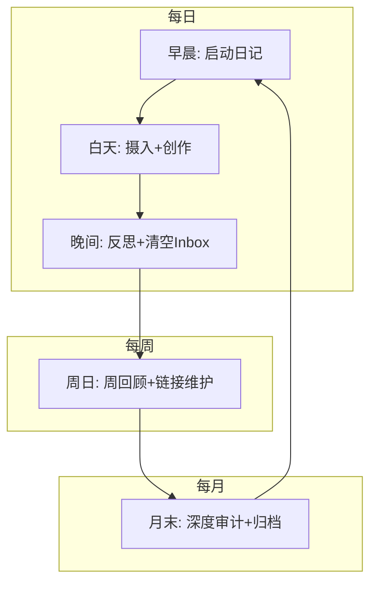

# 知识库工作流手册

> 本文档定义了知识库的所有标准操作流程。每个流程都标注了触发条件、执行步骤、涉及技能和预期产出。

---

## 工作流全景图

```
早晨 ──→ 白日 ──→ 晚间 ──→ 周末 ──→ 月末
  │        │        │        │        │
  ▼        ▼        ▼        ▼        ▼
日启动   摄入/创作   日收尾   周回顾   月审计
  │        │        │        │        │
  ├─ 日记   ├─ 捕获   ├─ 日记   ├─ 周记   ├─ 月记
  ├─ 回顾   ├─ 消化   ├─ 反思   ├─ 审计   ├─ 审计
  └─ 规划   ├─ 撰写   └─ 清空   ├─ 链接   ├─ 归档
            ├─ 会议   Inbox    └─ 规划   └─ MOC
            └─ 阅读                              更新
```

---

## 一、日常流程

### 1.1 早晨启动（3 分钟）

**触发**：每个工作日早晨，或说 `/daily-concierge` "创建今天的日记"

**执行步骤**：

| 步骤 | 操作 | 命令/技能 | 产出 |
|------|------|-----------|------|
| 1 | 创建今日日记模板 | `daily-concierge` | `5-Journal/daily/YYYY/YYYY-MM-DD.md` |
| 2 | 回顾昨日日记 | 自动拉取昨日关键事项 | 今日日记的"昨日回顾"区域 |
| 3 | 拉取活跃项目待办 | 自动搜索 status=active 的项目 | 今日日记的"今日任务"区域 |
| 4 | 设定今日 3 件要事 | 用户手动填写 | 今日日记的"今日目标"区域 |

**快速命令**：
```
/daily-concierge 创建今天的日记
```

**检查清单**：
- [ ] 今日日记已创建
- [ ] 3 件要事已确定
- [ ] 昨日未完成待办已迁移或放弃

---

### 1.2 日常摄入（随时，5-15 分钟）

#### 场景 A：遇到想保存的网页/文章

**触发**：看到好文章、技术博客、研究报告

| 步骤 | 操作 | 技能 | 产出 |
|------|------|------|------|
| 1 | 快速判断价值 | 自己 | — |
| 2 | 选择消化深度 | — | — |
| | · 不确定是否值得精读 | `info-digester` depth=summary | 对话中输出 300 字摘要 |
| | · 值得精读，但不需要拆解 | `info-digester` depth=detailed | `7-Sources/` 来源笔记 |
| | · 高价值内容，需要深度整合 | `info-digester` depth=atomic | 来源笔记 + N 篇概念笔记 |
| 3 | 确认笔记质量 | 检查链接和格式 | — |

**快速命令**：
```
/info-digester 消化这篇文章：{URL}，depth=detailed
/reading-digester 快速摘要：{URL}
```

#### 场景 B：突然有个想法

**触发**：脑中闪现的想法、灵感、待办

| 步骤 | 操作 | 技能 | 产出 |
|------|------|------|------|
| 1 | 快速捕获（最快方式） | 直接扔到 `0-Inbox/` | 临时笔记 |
| 2 | 稍后处理（当天晚间） | — | 转入正确目录或合并 |

**快速捕获方式**：
- Obsidian 中 `Ctrl+N` 新建笔记，路径选 `0-Inbox/`
- 或直接对 Claude Code 说：`记录一个想法：{内容}`

**检查清单**：
- [ ] Inbox 当天已清空

#### 场景 C：读完一本书的一个章节

**触发**：阅读过程中或读完一个章节后

| 步骤 | 操作 | 技能 | 产出 |
|------|------|------|------|
| 1 | 记录章节笔记 | `reading-digester` | 追加到来源笔记 |
| 2 | 提取关键概念 | `reading-digester` 或 `concept-atomizer` | 概念笔记 |
| 3 | 更新阅读进度 | `source-curator` | 来源笔记的 progress 字段 |

**快速命令**：
```
/reading-digester 记录章节笔记：《书名》第X章，核心内容是...
```

---

### 1.3 日常创作（随时，10-30 分钟）

#### 场景 D：撰写一篇知识笔记

**触发**：想整理某个概念、写一篇系统性的笔记

| 步骤 | 操作 | 技能 | 产出 |
|------|------|------|------|
| 1 | 确定笔记类型和位置 | `note-composer` | — |
| 2 | 从大纲生成正文 | `note-composer` | `4-Resources/` 笔记 |
| 3 | 自动推荐链接 | `note-composer` 内置 | 链接到已有笔记 |
| 4 | 润色和补充 | `note-polisher` | 提升 confidence |

**快速命令**：
```
/note-composer 写一篇关于 {主题} 的笔记，放在 4-Resources/{domain}/
/note-polisher 润色 {笔记名}
```

#### 场景 E：整理会议纪要

**触发**：会议结束后

| 步骤 | 操作 | 技能 | 产出 |
|------|------|------|------|
| 1 | 提供会议转录或笔记 | `meeting-minutes` | `2-Projects/{项目}/notes/` 或根目录 |
| 2 | 确认行动项和决策 | 用户核实 | — |
| 3 | 通知相关负责人 | 手动 | — |

**快速命令**：
```
/meeting-minutes 整理会议纪要：主题是...参会人有...讨论内容...
```

---

### 1.4 晚间收尾（7 分钟）

**触发**：每天结束工作前，或说 `/daily-concierge` "晚间反思"

| 步骤 | 操作 | 技能 | 产出 |
|------|------|------|------|
| 1 | 填写晚间反思 | `daily-concierge` | 完善今日日记 |
| 2 | 清空 Inbox | 手动或 `note-composer` | Inbox → 0 |
| 3 | 检查是否有可提炼的知识种子 | `daily-concierge` (extract) | 建议创建/更新的永久笔记 |

**快速命令**：
```
/daily-concierge 晚间反思
```

**晚间反思问题**：
1. 今天完成了什么？（与早晨的三件事对比）
2. 学到了什么？（标记可提炼的知识种子）
3. 明天改进什么？

---

## 二、每周流程（周日，30 分钟）

**触发**：每周日，或说 `/daily-concierge` "周回顾"

### 完整步骤

| 步骤 | 操作 | 技能 | 产出 | 预计时间 |
|------|------|------|------|----------|
| 1 | 创建本周回顾 | `daily-concierge` (weekly review) | `5-Journal/weekly/YYYY-W{周数}.md` | 5 分钟 |
| 2 | 汇总本周数据 | `daily-concierge` 自动 | 心情/精力趋势、习惯完成率 | 2 分钟 |
| 3 | 审计本周新增笔记 | `note-polisher` (batch mode) | 质量报告 | 5 分钟 |
| 4 | 检查孤岛笔记 | `vault-cartographer` (link analysis) | 孤岛链接修复建议 | 5 分钟 |
| 5 | 更新 MOC | `vault-cartographer` (MOC update) | MOC 完整性检查 | 5 分钟 |
| 6 | 处理上周遗留待办 | 手动 | 迁移或放弃 | 3 分钟 |
| 7 | 规划下周重点 | 手动 | 下周优先事项列表 | 5 分钟 |

**快速命令**：
```
/daily-concierge 创建本周回顾
/vault-cartographer 检查本周新增笔记的链接
/note-polisher 批量检查本周笔记质量
```

**周日检查清单**：
- [ ] 本周回顾已创建
- [ ] Inbox 已清空
- [ ] 本周新增笔记 ≥ 3 篇（如果不是，下周加强摄入）
- [ ] 孤岛笔记 ≤ 5 篇
- [ ] 每个活跃项目有本周进展记录
- [ ] 下周重点已确定

---

## 三、每月流程（月末，1 小时）

**触发**：每月最后一天或第一天，或说 `/daily-concierge` "月回顾"

### 完整步骤

| 步骤 | 操作 | 技能 | 产出 | 预计时间 |
|------|------|------|------|----------|
| 1 | 创建本月回顾 | `daily-concierge` (monthly review) | `5-Journal/monthly/YYYY-MM.md` | 10 分钟 |
| 2 | 全面知识库审计 | `vault-cartographer` (full report) | 知识库图谱报告 | 10 分钟 |
| 3 | 质量深度审计 | `note-polisher` (batch, global) | 所有笔记评分 | 15 分钟 |
| 4 | 修复发现的问题 | 手动 + 各技能 | 修复后的笔记 | 10 分钟 |
| 5 | 归档已完成项目 | 手动 | 移至 `99-Archives/`（可选） | 5 分钟 |
| 6 | 更新核心 MOC | `vault-cartographer` (MOC update, all) | 所有 MOC 更新 | 5 分钟 |
| 7 | 下月规划 | 手动 | 下月重点和目标 | 5 分钟 |

**快速命令**：
```
/daily-concierge 创建本月回顾
/vault-cartographer 生成知识库图谱报告
/note-polisher 检查 4-Resources 的全部笔记质量
```

**月末检查清单**：
- [ ] 本月回顾已创建
- [ ] 知识库审计报告已生成
- [ ] 所有 C/D 级笔记已修复或标记
- [ ] 已完成项目已归档
- [ ] 核心 MOC 已更新
- [ ] 本月知识库增量统计：新增笔记 ≥ 15 篇

---

## 四、专项流程

### 4.1 知识库初始化（一次性）

**触发**：新 vault 建立后

| 步骤 | 操作 | 产出 |
|------|------|------|
| 1 | 阅读 `9-System/知识库体系设计.md` | 理解设计理念 |
| 2 | 阅读 `9-System/命名规范.md` | 了解命名约定 |
| 3 | 阅读 `9-System/标签体系.md` | 了解标签体系 |
| 4 | 浏览 `8-Templates/` | 熟悉可用模板 |
| 5 | 迁移已有散落笔记 | 归入对应目录 |
| 6 | 创建第一篇每日日记 | 开始积累 |
| 7 | 用 `note-composer` 写第一篇笔记 | 体验完整流程 |

---

### 4.2 新建项目

**触发**：开始一个新项目

| 步骤 | 操作 | 技能 | 产出 |
|------|------|------|------|
| 1 | 创建项目文件夹和概述 | `note-composer` type=project | `2-Projects/{项目名}/{项目名}.md` |
| 2 | 设定目标和关键结果 | 手动 | — |
| 3 | 拆解第一阶段任务 | 手动 | — |
| 4 | 关联相关资源和人员 | 搜索并链接 | wikilinks |

---

### 4.3 读完一本书（完整流程）

**触发**：读完整本书

| 步骤 | 操作 | 技能 | 产出 |
|------|------|------|------|
| 1 | 标注为已读完 | `reading-digester` | 更新来源笔记 status |
| 2 | 生成全书摘要和核心论点 | `reading-digester` | 来源笔记 `## 核心论点` |
| 3 | 提取关键概念 | `concept-atomizer` | 多篇原子概念笔记 |
| 4 | 链接到已有知识网络 | `vault-cartographer` | 更新 MOC |
| 5 | 写下行动项 | 手动 | 来源笔记 `## 行动项` |
| 6 | 与其他书籍对话 | `reading-digester` | 来源笔记 `## 与其他书籍的对话` |

---

### 4.4 知识库健康急救

**触发**：感觉知识库混乱、找不到东西时

| 步骤 | 操作 | 技能 |
|------|------|------|
| 1 | 全面审计 | `vault-cartographer` 生成图谱报告 |
| 2 | 修复链接 | `vault-cartographer` 失效链接修复 |
| 3 | 清理存根笔记 | 手动 + `note-polisher` 识别存根 |
| 4 | 重组 MOC | `vault-cartographer` 重新生成核心 MOC |
| 5 | 统一标签 | `note-polisher` 批量一致性检查 |
| 6 | 处理 Inbox 积压 | 逐条处理或批量归档 |

---

## 五、快速命令索引

### 日常高频

| 我想... | 命令 |
|---------|------|
| 开始新的一天 | `/daily-concierge 创建今天的日记` |
| 晚上收尾 | `/daily-concierge 晚间反思` |
| 写一篇笔记 | `/note-composer 写一篇关于 {主题} 的笔记` |
| 消化一篇文章 | `/info-digester {URL}` |
| 快速摘要 | `/info-digester {URL} depth=summary` |
| 深入拆解 | `/info-digester {URL} depth=atomic` |
| 记录会议 | `/meeting-minutes {会议内容}` |
| 润色笔记 | `/note-polisher {笔记名}` |
| 记录一个想法 | `丢到 0-Inbox/` |

### 阅读

| 我想... | 命令 |
|---------|------|
| 添加待读书籍 | `/reading-digester 添加：《书名》，作者：{作者}` |
| 记录章节笔记 | `/reading-digester 第X章笔记：《书名》...` |
| 读完全书 | `/reading-digester 读完了《书名》` |
| 查看书架 | `/reading-digester 查看书架` |

### 维护

| 我想... | 命令 |
|---------|------|
| 周回顾 | `/daily-concierge 创建本周回顾` |
| 月回顾 | `/daily-concierge 创建本月回顾` |
| 知识库审计 | `/vault-cartographer 生成图谱报告` |
| 检查链接 | `/vault-cartographer 检查链接健康` |
| 更新 MOC | `/vault-cartographer 更新 MOC-{领域}` |
| 拆解长笔记 | `/concept-atomizer {笔记名}` |
| 批量质量检查 | `/note-polisher 检查 {目录} 的全部笔记` |

---

## 六、工作流节奏建议



**最小可行习惯**（即使再忙也能坚持）：
1. 每天至少创建一份日记（早晨 2 分钟）
2. 每天至少处理一条 Inbox（晚间 1 分钟）
3. 每周至少写一篇知识笔记（周末 15 分钟）
4. 每月至少做一次知识库审计（月末 20 分钟）

如果只能做一件事：**每天写日记**。日记是整个系统的入口和原料。

---

> [!tip] 交互式向导
> 如果你不想手动记这些步骤，可以直接说 **"启动工作流向导"** 或使用 `/vault-wizard`，
> 交互式向导会引导你一步一步完成任何流程。
